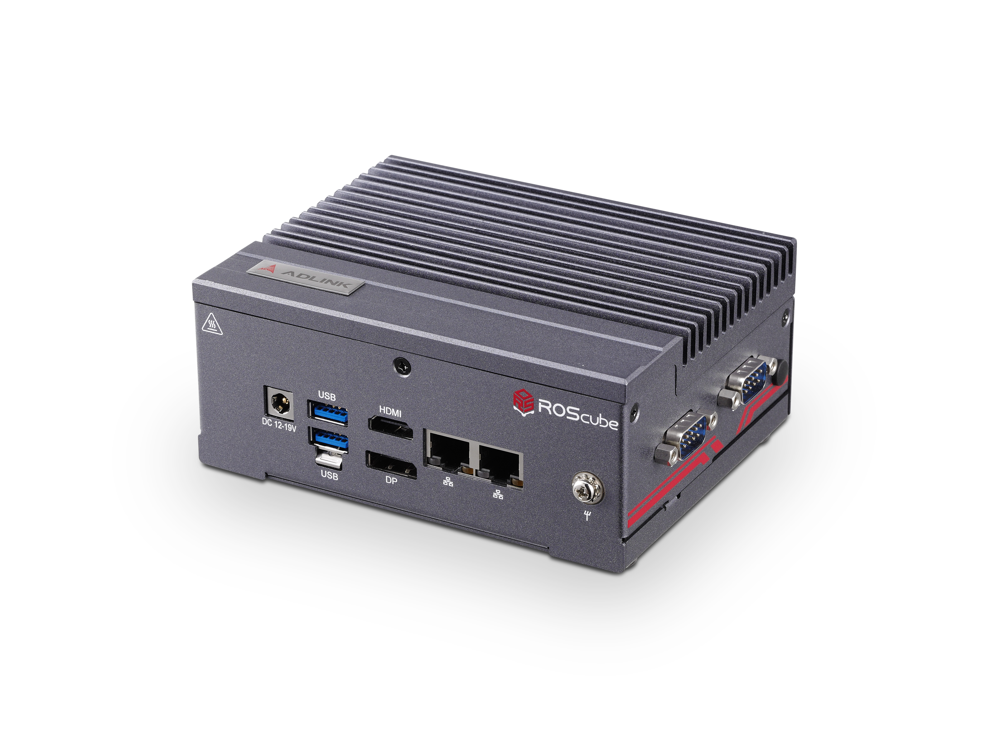

# Neuron App

This is a portal which collects all the latest Neuron Apps.

**Neuron App** is one of the most important features of ADLINK **Neuron SDK** which provides you the reference design of classic AMR (Autonomous Mobile Robot) applications. You can download the source codes and develop it by using **Neuron IDE**.

 
Neuron SDK and Neuron Apps have been tested and verified on our hardware platforms, including ROScube-I, ROScube-X, and all the ROScube series. Please visit [ADLINK official website](https://www.adlinktech.com/en/ROS2-Solution) for more information.

The Neuron Apps listed below are ready-to-use and essential for AMR applications, please click each link to see how to use it:

- SLAM:

    

    source code -> https://github.com/Adlink-ROS/neuron_app_slam

- Navigation:

    

    source code -> https://github.com/Adlink-ROS/neuron_app_navigation

- Auto Inspection:

    

    source code -> https://github.com/Adlink-ROS/neuron_app_inspection

---

Below apps are ready to use but hasn't been integrated into Neuron IDE:
- Auto Docking with Camera:

    

    source code -> https://github.com/Adlink-ROS/apriltag_docking

- 2D LiDAR SLAM Toolkit

    

    source code -> https://github.com/Adlink-ROS/pure-2d-lidar-slam-toolkit

- Multi-robot Navigation (ROS1)

    

    source code -> https://github.com/Adlink-ROS/neuronbot2_multibot
